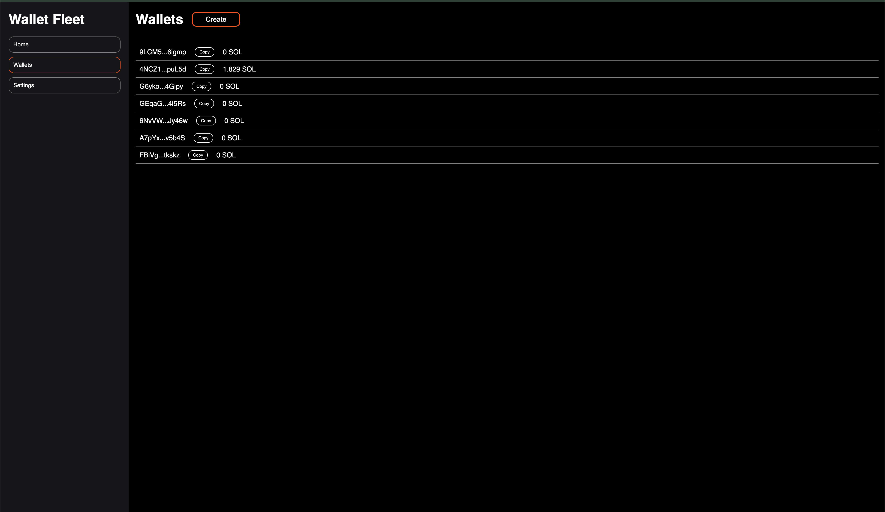

# rust-wallet-fleet

## Tasks

- Collect multithreaded
- Database in backend
- Swapping over 2-3 methods
- Propper logging solution (low priority)

## .env

`MNEMONI` must be a 24 byte seed to generate the wallets. Any additional bytes will be ignored

## Showcase

